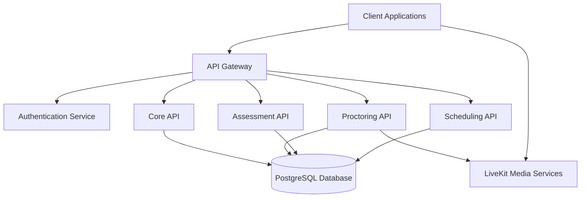

# Platform Architecture

The SmarterServices Platform is built on a modern, scalable architecture designed to provide reliable and secure proctoring, assessment, and scheduling services.

## Architecture Overview

The platform follows a microservices architecture with the following key components:

## Key Components

### Frontend

- **React UI**: Modern, responsive user interface built with React
- **SmarterElements**: Embeddable UI components for third-party integration
- **@smarterservices/smarter-ui**: Extended InstructureUI component library for consistent UI patterns

### Backend Services

- **API Gateway**: Routes requests to appropriate microservices
- **Authentication Service**: Handles user authentication and authorization
- **Core API**: Manages core platform functionality and shared resources
- **Proctoring API**: Handles proctoring sessions and monitoring
- **Assessment API**: Manages exams, questions, and results
- **Scheduling API**: Handles appointment scheduling and calendar management

### Data Storage

- **PostgreSQL**: Primary relational database for structured data
- **Redis**: In-memory data store for caching and real-time features
- **S3**: Object storage for files, recordings, and media

### Media Services

- **LiveKit**: Powers real-time audio/video for proctoring sessions
- **Media Processing**: Handles recording, playback, and analysis

## Deployment Architecture

The SmarterServices Platform is deployed on AWS with the following infrastructure:

- **Compute**: AWS ECS for containerized services
- **Serverless**: AWS Lambda for event-driven processing
- **Database**: AWS RDS for PostgreSQL
- **Storage**: S3 for object storage
- **CDN**: CloudFront for content delivery
- **Load Balancing**: Application Load Balancer for traffic distribution

## Security Architecture

Security is a core consideration in our architecture:

- **Authentication**: JWT-based authentication with secure token management
- **Authorization**: Role-based access control (RBAC) for all resources
- **Encryption**: Data encrypted at rest and in transit
- **Network Security**: VPC isolation, security groups, and WAF protection
- **Compliance**: SOC 2 Type II and FERPA compliant infrastructure

## Integration Points

The platform provides multiple integration options:

- **REST APIs**: Comprehensive API for direct integration
- **SmarterElements**: Embeddable UI components
- **Webhooks**: Event-driven notifications
- **LTI**: Learning Tools Interoperability for LMS integration
- **SSO**: Support for SAML and OAuth 2.0 identity providers
