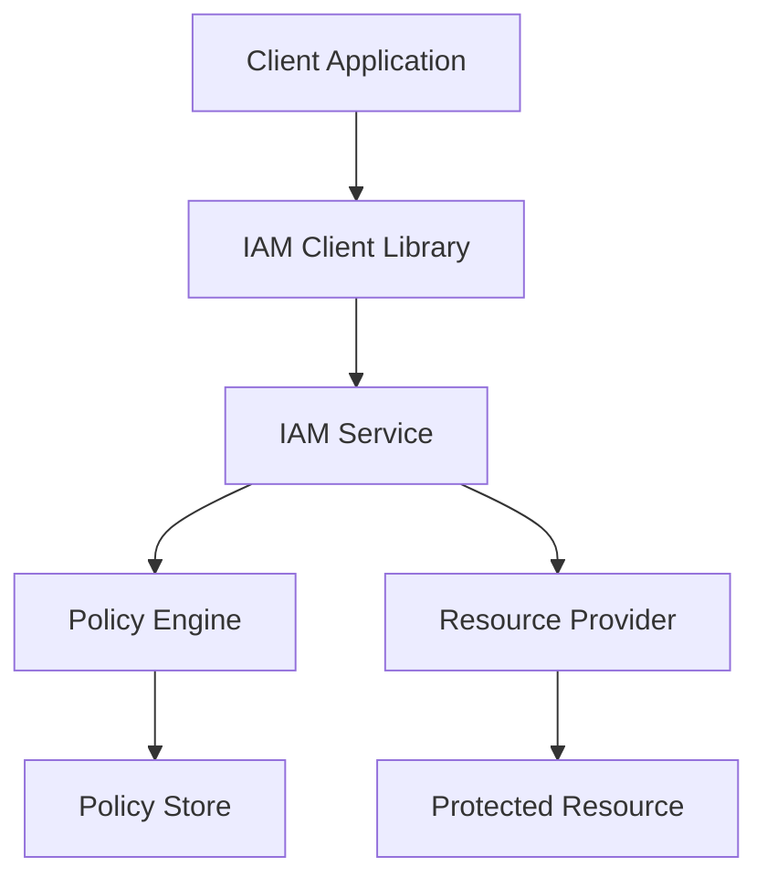

# Implementation Guide

This guide covers how to integrate the SmarterServices IAM system into your applications, including client libraries, server-side implementation, and best practices.

## Architecture Overview

The SmarterServices IAM system consists of:

1. **IAM Service**: Central authentication and authorization service
2. **Client Libraries**: Language-specific libraries for integration
3. **Policy Engine**: Evaluates permissions based on policies
4. **Resource Providers**: Services that enforce IAM decisions



## Client Libraries

### JavaScript/TypeScript (Browser)

#### Installation
```bash
npm install @smarterservices/iam-client
```

#### Basic Usage
```javascript
import { IamClient } from '@smarterservices/iam-client';

// Initialize the client
const iamClient = new IamClient({
  apiUrl: 'https://iam.smarterservices.com',
  token: 'your-auth-token'
});

// Check permissions
const canDelete = await iamClient.authorize(
  'sp:DeleteSession',
  'ssrn:ss:sp::578:session/ES123456'
);

if (canDelete) {
  // User has permission to delete the session
  deleteSession();
}
```

#### React Integration
```jsx
import React from 'react';
import { IamProtected } from '@smarterservices/iam-react';

function DeleteButton({ sessionId }) {
  return (
    <IamProtected 
      action="sp:DeleteSession" 
      resource={`ssrn:ss:sp::578:session/${sessionId}`}
    >
      <button onClick={handleDelete}>
        Delete Session
      </button>
    </IamProtected>
  );
}
```

### Node.js (Server)

#### Installation
```bash
npm install @smarterservices/iam-node
```

#### Basic Usage
```javascript
const { IamService } = require('@smarterservices/iam-node');

// Initialize the service
const iam = new IamService({
  apiUrl: 'https://iam.smarterservices.com',
  serviceKey: 'your-service-key'
});

// Middleware for Express.js
app.use('/api/sessions/:id', async (req, res, next) => {
  const authorized = await iam.authorize(
    req.user.token,
    'sp:ReadSession',
    `ssrn:ss:sp::${req.user.accountId}:session/${req.params.id}`
  );

  if (!authorized) {
    return res.status(403).json({ error: 'Forbidden' });
  }

  next();
});
```

### Python

#### Installation
```bash
pip install smarterservices-iam
```

#### Basic Usage
```python
from smarterservices_iam import IamClient

# Initialize the client
iam = IamClient(
    api_url='https://iam.smarterservices.com',
    service_key='your-service-key'
)

# Check permissions
authorized = iam.authorize(
    user_token='user-token',
    action='sm:ReadUser',
    resource='ssrn:ss:sm::578:user/8539699'
)

if authorized:
    # User has permission
    return get_user_data()
else:
    raise PermissionError('Access denied')
```

### Java

#### Maven Dependency
```xml
<dependency>
    <groupId>com.smarterservices</groupId>
    <artifactId>iam-client</artifactId>
    <version>1.0.0</version>
</dependency>
```

#### Basic Usage
```java
import com.smarterservices.iam.IamClient;

// Initialize the client
IamClient iam = new IamClient.Builder()
    .apiUrl("https://iam.smarterservices.com")
    .serviceKey("your-service-key")
    .build();

// Check permissions
boolean authorized = iam.authorize(
    userToken,
    "sm:ReadAssessment",
    "ssrn:ss:sm::578:assessment/AS123456"
);

if (authorized) {
    // User has permission
    return getAssessmentData();
} else {
    throw new SecurityException("Access denied");
}
```

## Server-Side Implementation

### Express.js Middleware

```javascript
const { IamService } = require('@smarterservices/iam-node');

const iam = new IamService({
  apiUrl: process.env.IAM_API_URL,
  serviceKey: process.env.IAM_SERVICE_KEY
});

// Generic IAM middleware
function requirePermission(action, resourceTemplate) {
  return async (req, res, next) => {
    try {
      // Build resource string from template
      const resource = resourceTemplate.replace(/\{(\w+)\}/g, (match, key) => {
        return req.params[key] || req.user[key] || match;
      });

      const authorized = await iam.authorize(
        req.user.token,
        action,
        resource
      );

      if (!authorized) {
        return res.status(403).json({ 
          error: 'Forbidden',
          message: `Insufficient permissions for ${action} on ${resource}`
        });
      }

      next();
    } catch (error) {
      console.error('IAM authorization error:', error);
      res.status(500).json({ error: 'Authorization service unavailable' });
    }
  };
}

// Usage examples
app.get('/api/sessions/:id', 
  requirePermission('sp:ReadSession', 'ssrn:ss:sp::{accountId}:session/{id}'),
  getSession
);

app.delete('/api/sessions/:id',
  requirePermission('sp:DeleteSession', 'ssrn:ss:sp::{accountId}:session/{id}'),
  deleteSession
);
```

### FastAPI (Python)

```python
from fastapi import FastAPI, Depends, HTTPException
from smarterservices_iam import IamClient

app = FastAPI()
iam = IamClient(
    api_url=os.getenv('IAM_API_URL'),
    service_key=os.getenv('IAM_SERVICE_KEY')
)

def require_permission(action: str, resource_template: str):
    def dependency(user_token: str, **path_params):
        # Build resource string
        resource = resource_template.format(**path_params)
        
        if not iam.authorize(user_token, action, resource):
            raise HTTPException(status_code=403, detail="Forbidden")
        
        return True
    
    return dependency

@app.get("/sessions/{session_id}")
async def get_session(
    session_id: str,
    authorized: bool = Depends(
        require_permission(
            "sp:ReadSession", 
            "ssrn:ss:sp::{account_id}:session/{session_id}"
        )
    )
):
    return get_session_data(session_id)
```

### Spring Boot (Java)

```java
@RestController
@RequestMapping("/api/sessions")
public class SessionController {
    
    @Autowired
    private IamService iamService;
    
    @GetMapping("/{id}")
    @RequirePermission(action = "sp:ReadSession", resource = "ssrn:ss:sp::{accountId}:session/{id}")
    public ResponseEntity<Session> getSession(@PathVariable String id) {
        return ResponseEntity.ok(sessionService.getSession(id));
    }
    
    @DeleteMapping("/{id}")
    @RequirePermission(action = "sp:DeleteSession", resource = "ssrn:ss:sp::{accountId}:session/{id}")
    public ResponseEntity<Void> deleteSession(@PathVariable String id) {
        sessionService.deleteSession(id);
        return ResponseEntity.noContent().build();
    }
}

// Custom annotation
@Target(ElementType.METHOD)
@Retention(RetentionPolicy.RUNTIME)
public @interface RequirePermission {
    String action();
    String resource();
}

// Aspect for handling the annotation
@Aspect
@Component
public class IamAspect {
    
    @Autowired
    private IamService iamService;
    
    @Before("@annotation(requirePermission)")
    public void checkPermission(JoinPoint joinPoint, RequirePermission requirePermission) {
        // Extract user token and build resource string
        String userToken = getCurrentUserToken();
        String resource = buildResourceString(requirePermission.resource(), joinPoint.getArgs());
        
        if (!iamService.authorize(userToken, requirePermission.action(), resource)) {
            throw new SecurityException("Access denied");
        }
    }
}
```

## Frontend Integration

### React Hook

```jsx
import { useState, useEffect } from 'react';
import { useIamClient } from '@smarterservices/iam-react';

export function usePermission(action, resource) {
  const [hasPermission, setHasPermission] = useState(false);
  const [loading, setLoading] = useState(true);
  const iamClient = useIamClient();

  useEffect(() => {
    async function checkPermission() {
      try {
        const authorized = await iamClient.authorize(action, resource);
        setHasPermission(authorized);
      } catch (error) {
        console.error('Permission check failed:', error);
        setHasPermission(false);
      } finally {
        setLoading(false);
      }
    }

    checkPermission();
  }, [action, resource, iamClient]);

  return { hasPermission, loading };
}

// Usage
function SessionActions({ sessionId }) {
  const { hasPermission: canDelete, loading } = usePermission(
    'sp:DeleteSession',
    `ssrn:ss:sp::578:session/${sessionId}`
  );

  if (loading) return <div>Loading...</div>;

  return (
    <div>
      {canDelete && (
        <button onClick={handleDelete}>Delete Session</button>
      )}
    </div>
  );
}
```

### Vue.js Directive

```javascript
import { IamClient } from '@smarterservices/iam-client';

const iam = new IamClient({
  apiUrl: process.env.VUE_APP_IAM_API_URL,
  token: () => store.getters.authToken
});

// Custom directive
Vue.directive('iam', {
  async bind(el, binding) {
    const { action, resource } = binding.value;
    
    try {
      const authorized = await iam.authorize(action, resource);
      if (!authorized) {
        el.style.display = 'none';
      }
    } catch (error) {
      console.error('IAM check failed:', error);
      el.style.display = 'none';
    }
  }
});

// Usage in template
<template>
  <div>
    <button 
      v-iam="{ action: 'sp:DeleteSession', resource: `ssrn:ss:sp::578:session/${sessionId}` }"
      @click="deleteSession"
    >
      Delete Session
    </button>
  </div>
</template>
```

## Configuration

### Environment Variables

```bash
# IAM Service Configuration
IAM_API_URL=https://iam.smarterservices.com
IAM_SERVICE_KEY=your-service-key
IAM_CACHE_TTL=300
IAM_TIMEOUT=5000

# Application Configuration
APP_ACCOUNT_ID=578
APP_SERVICE=sp
APP_REGION=us-east-1
```

### Configuration File

```json
{
  "iam": {
    "apiUrl": "https://iam.smarterservices.com",
    "serviceKey": "${IAM_SERVICE_KEY}",
    "cache": {
      "enabled": true,
      "ttl": 300,
      "maxSize": 1000
    },
    "timeout": 5000,
    "retries": 3
  },
  "application": {
    "accountId": "578",
    "service": "sp",
    "region": "us-east-1"
  }
}
```

## Caching

### Client-Side Caching

```javascript
import { IamClient } from '@smarterservices/iam-client';

const iam = new IamClient({
  apiUrl: 'https://iam.smarterservices.com',
  token: 'your-token',
  cache: {
    enabled: true,
    ttl: 300, // 5 minutes
    maxSize: 1000
  }
});

// Permissions are cached automatically
const canRead = await iam.authorize('sp:ReadSession', 'ssrn:ss:sp::578:session/ES123');
```

### Server-Side Caching

```javascript
const Redis = require('redis');
const { IamService } = require('@smarterservices/iam-node');

const redis = Redis.createClient();
const iam = new IamService({
  apiUrl: 'https://iam.smarterservices.com',
  serviceKey: 'your-service-key',
  cache: {
    get: async (key) => {
      const value = await redis.get(key);
      return value ? JSON.parse(value) : null;
    },
    set: async (key, value, ttl) => {
      await redis.setex(key, ttl, JSON.stringify(value));
    }
  }
});
```

## Error Handling

### Client-Side Error Handling

```javascript
try {
  const authorized = await iam.authorize(action, resource);
  if (authorized) {
    // Proceed with action
  } else {
    // Show access denied message
    showError('You do not have permission to perform this action');
  }
} catch (error) {
  if (error.code === 'NETWORK_ERROR') {
    // Handle network issues
    showError('Unable to verify permissions. Please try again.');
  } else if (error.code === 'INVALID_TOKEN') {
    // Handle authentication issues
    redirectToLogin();
  } else {
    // Handle other errors
    console.error('IAM error:', error);
    showError('Permission check failed');
  }
}
```

### Server-Side Error Handling

```javascript
app.use((error, req, res, next) => {
  if (error.name === 'IamError') {
    switch (error.code) {
      case 'FORBIDDEN':
        return res.status(403).json({
          error: 'Forbidden',
          message: 'Insufficient permissions'
        });
      case 'UNAUTHORIZED':
        return res.status(401).json({
          error: 'Unauthorized',
          message: 'Invalid or expired token'
        });
      case 'SERVICE_UNAVAILABLE':
        return res.status(503).json({
          error: 'Service Unavailable',
          message: 'Authorization service is temporarily unavailable'
        });
      default:
        return res.status(500).json({
          error: 'Internal Server Error',
          message: 'Authorization check failed'
        });
    }
  }
  
  next(error);
});
```

## Testing

### Unit Testing

```javascript
// Mock IAM client for testing
jest.mock('@smarterservices/iam-client');

const { IamClient } = require('@smarterservices/iam-client');

describe('Session Controller', () => {
  beforeEach(() => {
    IamClient.mockClear();
  });

  test('should allow access with proper permissions', async () => {
    const mockAuthorize = jest.fn().mockResolvedValue(true);
    IamClient.mockImplementation(() => ({
      authorize: mockAuthorize
    }));

    const response = await request(app)
      .get('/api/sessions/ES123456')
      .set('Authorization', 'Bearer valid-token')
      .expect(200);

    expect(mockAuthorize).toHaveBeenCalledWith(
      'sp:ReadSession',
      'ssrn:ss:sp::578:session/ES123456'
    );
  });

  test('should deny access without permissions', async () => {
    const mockAuthorize = jest.fn().mockResolvedValue(false);
    IamClient.mockImplementation(() => ({
      authorize: mockAuthorize
    }));

    await request(app)
      .get('/api/sessions/ES123456')
      .set('Authorization', 'Bearer valid-token')
      .expect(403);
  });
});
```

### Integration Testing

```javascript
describe('IAM Integration', () => {
  test('should integrate with real IAM service', async () => {
    const iam = new IamClient({
      apiUrl: process.env.TEST_IAM_API_URL,
      token: process.env.TEST_TOKEN
    });

    const authorized = await iam.authorize(
      'sp:ReadSession',
      'ssrn:ss:sp::578:session/test-session'
    );

    expect(typeof authorized).toBe('boolean');
  });
});
```

## Best Practices

### 1. Use Least Privilege
Only request the minimum permissions needed for functionality.

### 2. Cache Appropriately
Cache permission results to improve performance, but ensure cache invalidation works correctly.

### 3. Handle Errors Gracefully
Always handle IAM service failures gracefully with appropriate fallbacks.

### 4. Validate Resources
Ensure resource strings are properly formatted and validated.

### 5. Monitor Performance
Monitor IAM service response times and implement circuit breakers if needed.

### 6. Secure Service Keys
Store service keys securely and rotate them regularly.

### 7. Log Security Events
Log all authorization decisions for audit and debugging purposes.

## Troubleshooting

### Common Issues

1. **Invalid Resource Format**: Ensure SSRN format is correct
2. **Token Expiration**: Handle token refresh properly
3. **Network Timeouts**: Implement proper timeout and retry logic
4. **Cache Inconsistency**: Ensure cache invalidation works correctly
5. **Permission Lag**: Account for eventual consistency in permission updates

### Debugging

1. **Enable Debug Logging**: Set log level to debug for detailed information
2. **Check Network Connectivity**: Verify IAM service is reachable
3. **Validate Tokens**: Ensure authentication tokens are valid
4. **Test Policies**: Use IAM policy simulator for testing
5. **Monitor Metrics**: Track authorization success/failure rates
