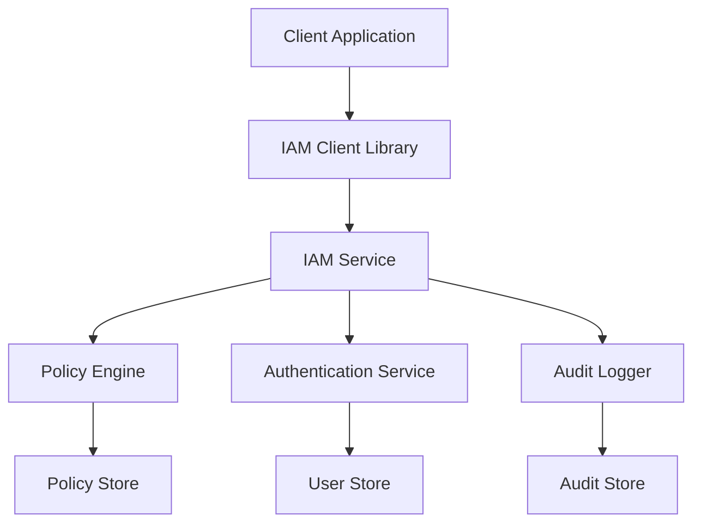

# Platform Security & IAM

The SmarterServices platform uses a comprehensive Identity and Access Management (IAM) system to provide secure, granular access control across all services and resources.

## What is IAM?

IAM is a format (syntax) that helps securely control access to your applications at the resource level. A resource can be any information that can be accessed using any API. Users might have read access but not write permission. Who has permission to what action on a resource is defined by a **policy**.

This library was largely inspired by the [AWS IAM](http://docs.aws.amazon.com/IAM/latest/UserGuide/introduction.html) service. Unlike AWS, this library does not actually provide any "server" component, rather it simply defines the standard format that can be integrated into another authentication service.

### Key Benefits

- **Human Readable**: Policy files are easy to understand and modify
- **Granular Control**: Control access at the individual resource level
- **Flexible**: Support for wildcards and complex conditions
- **Secure by Default**: All requests are denied unless explicitly allowed

## Core Concepts

### 1. Resources
Every protected item in the system is identified by a unique resource name using our SmarterServices Resource Name (SSRN) format.

### 2. Actions
Specific operations that can be performed on resources (e.g., read, write, delete).

### 3. Policies
JSON documents that define what actions are allowed or denied on specific resources.

### 4. Conditions
Optional constraints that must be met for a policy to apply (e.g., time-based access, IP restrictions).

## Policy Evaluation Logic

When a request is made, the IAM service follows these rules:

1. **Default Deny**: All requests are denied by default
2. **Explicit Allow**: An explicit allow overrides the default deny
3. **Explicit Deny**: An explicit deny overrides any allows

> **Important**: All policies are evaluated, and an explicit deny always takes precedence over any allow statements.

The order in which the policies are evaluated has no effect on the outcome of the evaluation. All policies are evaluated, and the result is always that the request is either allowed or denied.

## Documentation Structure

### Core Concepts

<div className="grid grid-cols-1 md:grid-cols-2 gap-6 my-8">
  <div className="border rounded-lg p-6">
    <h3 className="text-lg font-semibold mb-2">
      <a href="./quickstart" className="text-blue-600 hover:text-blue-800">
        🚀 Quick Start
      </a>
    </h3>
    <p className="text-gray-600">
      Get up and running with IAM in minutes with practical examples.
    </p>
  </div>

  <div className="border rounded-lg p-6">
    <h3 className="text-lg font-semibold mb-2">
      <a href="./resources" className="text-blue-600 hover:text-blue-800">
        🏷️ Resources (SSRN)
      </a>
    </h3>
    <p className="text-gray-600">
      SmarterServices Resource Name format for identifying protected resources.
    </p>
  </div>

  <div className="border rounded-lg p-6">
    <h3 className="text-lg font-semibold mb-2">
      <a href="./actions" className="text-blue-600 hover:text-blue-800">
        ⚡ Actions
      </a>
    </h3>
    <p className="text-gray-600">
      Action naming conventions, wildcards, and service-specific operations.
    </p>
  </div>

  <div className="border rounded-lg p-6">
    <h3 className="text-lg font-semibold mb-2">
      <a href="./policies" className="text-blue-600 hover:text-blue-800">
        📜 Policies
      </a>
    </h3>
    <p className="text-gray-600">
      Policy structure, syntax, examples, and role-based configurations.
    </p>
  </div>
</div>

### Advanced Features

<div className="grid grid-cols-1 md:grid-cols-2 gap-6 my-8">
  <div className="border rounded-lg p-6">
    <h3 className="text-lg font-semibold mb-2">
      <a href="./conditions" className="text-blue-600 hover:text-blue-800">
        🎯 Conditions
      </a>
    </h3>
    <p className="text-gray-600">
      Advanced conditional access controls for fine-grained permissions.
    </p>
  </div>

  <div className="border rounded-lg p-6">
    <h3 className="text-lg font-semibold mb-2">
      <a href="./clients" className="text-blue-600 hover:text-blue-800">
        📚 Client Libraries
      </a>
    </h3>
    <p className="text-gray-600">
      Available client libraries for different platforms and languages.
    </p>
  </div>
</div>

### Implementation

<div className="grid grid-cols-1 gap-6 my-8">
  <div className="border rounded-lg p-6">
    <h3 className="text-lg font-semibold mb-2">
      <a href="./implementation" className="text-blue-600 hover:text-blue-800">
        🛠️ Implementation Guide
      </a>
    </h3>
    <p className="text-gray-600">
      Complete guide for integrating IAM into your applications and services.
    </p>
  </div>
</div>

## Key Features

### 🔒 **Secure by Default**
All requests are denied unless explicitly allowed by policy.

### 🎯 **Granular Control**
Control access at the individual resource level with flexible conditions.

### 📈 **Scalable**
Designed to handle enterprise-scale applications with high performance.

### 🔧 **Developer Friendly**
Simple APIs and comprehensive client libraries for all major platforms.

### 📊 **Auditable**
Complete audit trail of all authorization decisions.

### ⚡ **High Performance**
Built-in caching and optimized for low-latency operations.

## Common Use Cases

### Student Portal Access
```json
{
  "Effect": "Allow",
  "Action": ["sm:ReadAssessment", "sm:SubmitAssessment"],
  "Resource": ["ssrn:ss:sm::578:assessment/*"],
  "Condition": {
    "Equals": {
      "user:role": "student"
    }
  }
}
```

### Proctor Session Management
```json
{
  "Effect": "Allow",
  "Action": ["sp:MonitorSession", "sp:CreateAnnotation"],
  "Resource": ["ssrn:ss:sp::578:session/*"],
  "Condition": {
    "Equals": {
      "session:assignedProctor": "${user.proctorId}"
    }
  }
}
```

### Administrative Access
```json
{
  "Effect": "Allow",
  "Action": ["platform:*"],
  "Resource": ["ssrn:ss:*::578:*"],
  "Condition": {
    "Equals": {
      "user:role": "admin"
    },
    "Bool": {
      "aws:MultiFactorAuthPresent": "true"
    }
  }
}
```

## Service Coverage

### SmarterMeasure (sm:)
- **User Management**: Create, read, update, delete users
- **Assessment Management**: Full assessment lifecycle
- **Course Management**: Course creation and enrollment
- **Reporting**: Analytics and data export

### SmarterProctoring (sp:)
- **Session Management**: Proctoring session control
- **Exam Management**: Exam scheduling and configuration
- **Monitoring**: Real-time session monitoring
- **Recording & Annotations**: Session review and annotation

### Platform Services
- **Account Management**: Multi-tenant account administration
- **System Administration**: Platform-wide configuration
- **Integration Management**: Third-party service integration

## Architecture



## Support and Resources

### 📖 **Documentation**
Complete documentation with examples and best practices.

### 🛠️ **Client Libraries**
Production-ready libraries for all major platforms and languages.

### 🔍 **Policy Simulator**
Test and validate policies before deployment.

### 📊 **Monitoring Dashboard**
Real-time monitoring of authorization decisions and performance.

### 🎯 **Developer Tools**
CLI tools for policy management and testing.

## Security Considerations

- **Token Security**: Store authentication tokens securely
- **Network Security**: Use HTTPS for all IAM communications
- **Audit Logging**: Enable comprehensive audit logging
- **Regular Reviews**: Periodically review and update policies
- **Least Privilege**: Grant minimum necessary permissions

## Performance Optimization

- **Caching**: Enable client-side permission caching
- **Batch Operations**: Use bulk permission checks when possible
- **Connection Pooling**: Reuse connections for server-side clients
- **Monitoring**: Monitor IAM service response times

## Compliance

The SmarterServices IAM system supports compliance with:
- **FERPA**: Educational record privacy
- **GDPR**: Data protection and privacy
- **SOC 2**: Security and availability controls
- **WCAG**: Web accessibility guidelines

---

For questions or support, contact the Platform Security team or visit our [GitHub repositories](https://github.com/SmarterServices/IAM).
