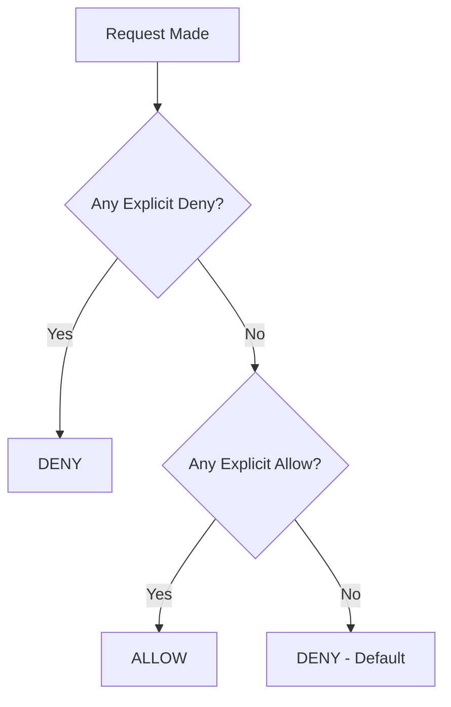

# Policy Structure

IAM policies are JSON documents that define permissions for users, roles, or applications. They specify what actions are allowed or denied on specific resources under certain conditions.

## Basic Policy Structure

```json
{
  "Version": "2023-01-01",
  "Statement": [
    {
      "Effect": "Allow",
      "Action": ["sm:ReadUser"],
      "Resource": ["ssrn:ss:sm::578:user/8539699"]
    }
  ]
}
```

## Policy Elements

### Version
Specifies the policy language version. Always use the latest version for new policies.

```json
{
  "Version": "2023-01-01"
}
```

### Statement
An array of individual permission statements. Each statement is evaluated independently.

```json
{
  "Statement": [
    {
      "Effect": "Allow",
      "Action": ["sm:ReadUser"],
      "Resource": ["ssrn:ss:sm::578:user/*"]
    },
    {
      "Effect": "Deny",
      "Action": ["sm:DeleteUser"],
      "Resource": ["ssrn:ss:sm::578:user/admin"]
    }
  ]
}
```

### Effect
Specifies whether the statement allows or denies access. Must be either `"Allow"` or `"Deny"`.

```json
{
  "Effect": "Allow"  // or "Deny"
}
```

### Action
Specifies the actions that the statement applies to. Can be a single action or an array of actions.

```json
{
  "Action": "sm:ReadUser"
}
```

```json
{
  "Action": [
    "sm:ReadUser",
    "sm:UpdateUser",
    "sp:ReadSession"
  ]
}
```

### Resource
Specifies the resources that the statement applies to. Can be a single resource or an array of resources.

```json
{
  "Resource": "ssrn:ss:sm::578:user/8539699"
}
```

```json
{
  "Resource": [
    "ssrn:ss:sm::578:user/*",
    "ssrn:ss:sp::578:session/*"
  ]
}
```

### Condition (Optional)
Specifies conditions that must be met for the statement to apply.

```json
{
  "Condition": {
    "Equals": {
      "session:proctorAccountSid": "PA123456"
    }
  }
}
```

## Policy Evaluation Logic

The IAM system evaluates policies using the following logic:

1. **Default Deny**: All requests are denied by default
2. **Explicit Allow**: An explicit allow overrides the default deny
3. **Explicit Deny**: An explicit deny overrides any allows
4. **All Policies Evaluated**: The order of policies doesn't matter

### Evaluation Flow



## Common Policy Patterns

### 1. Read-Only Access

```json
{
  "Version": "2023-01-01",
  "Statement": [
    {
      "Effect": "Allow",
      "Action": [
        "sm:Read*",
        "sm:View*",
        "sp:Read*",
        "sp:View*"
      ],
      "Resource": ["ssrn:ss:*::578:*"]
    }
  ]
}
```

### 2. Full Access to Specific Service

```json
{
  "Version": "2023-01-01",
  "Statement": [
    {
      "Effect": "Allow",
      "Action": ["sm:*"],
      "Resource": ["ssrn:ss:sm::578:*"]
    }
  ]
}
```

### 3. Conditional Access

```json
{
  "Version": "2023-01-01",
  "Statement": [
    {
      "Effect": "Allow",
      "Action": ["sp:ReadSession"],
      "Resource": ["ssrn:ss:sp::578:session/*"],
      "Condition": {
        "Equals": {
          "session:proctorAccountSid": "PA123456"
        }
      }
    }
  ]
}
```

### 4. Mixed Allow and Deny

```json
{
  "Version": "2023-01-01",
  "Statement": [
    {
      "Effect": "Allow",
      "Action": ["sm:*"],
      "Resource": ["ssrn:ss:sm::578:*"]
    },
    {
      "Effect": "Deny",
      "Action": ["sm:Delete*"],
      "Resource": ["ssrn:ss:sm::578:user/admin"]
    }
  ]
}
```

## Role-Based Policy Examples

### Student Role

```json
{
  "Version": "2023-01-01",
  "Statement": [
    {
      "Effect": "Allow",
      "Action": [
        "sm:ReadAssessment",
        "sm:SubmitAssessment",
        "sm:ViewResults"
      ],
      "Resource": [
        "ssrn:ss:sm::578:assessment/*",
        "ssrn:ss:sm::578:user/${user.id}"
      ]
    }
  ]
}
```

### Instructor Role

```json
{
  "Version": "2023-01-01",
  "Statement": [
    {
      "Effect": "Allow",
      "Action": [
        "sm:*Assessment*",
        "sm:ReadUser",
        "sm:*Course*",
        "sm:GenerateReport"
      ],
      "Resource": [
        "ssrn:ss:sm::578:assessment/*",
        "ssrn:ss:sm::578:course/*",
        "ssrn:ss:sm::578:user/*",
        "ssrn:ss:sm::578:report/*"
      ]
    }
  ]
}
```

### Proctor Role

```json
{
  "Version": "2023-01-01",
  "Statement": [
    {
      "Effect": "Allow",
      "Action": [
        "sp:ReadSession",
        "sp:MonitorSession",
        "sp:CreateAnnotation",
        "sp:UpdateAnnotation",
        "sp:ViewRecording"
      ],
      "Resource": ["ssrn:ss:sp::578:session/*"],
      "Condition": {
        "Equals": {
          "session:assignedProctor": "${user.proctorId}"
        }
      }
    }
  ]
}
```

### Administrator Role

```json
{
  "Version": "2023-01-01",
  "Statement": [
    {
      "Effect": "Allow",
      "Action": ["*"],
      "Resource": ["ssrn:ss:*::578:*"]
    },
    {
      "Effect": "Deny",
      "Action": ["platform:DeleteAccount"],
      "Resource": ["*"]
    }
  ]
}
```

## Service-Specific Policies

### SmarterMeasure Assessment Manager

```json
{
  "Version": "2023-01-01",
  "Statement": [
    {
      "Effect": "Allow",
      "Action": [
        "sm:CreateAssessment",
        "sm:ReadAssessment",
        "sm:UpdateAssessment",
        "sm:PublishAssessment",
        "sm:ArchiveAssessment"
      ],
      "Resource": ["ssrn:ss:sm::578:assessment/*"]
    },
    {
      "Effect": "Allow",
      "Action": ["sm:ReadUser", "sm:ReadCourse"],
      "Resource": [
        "ssrn:ss:sm::578:user/*",
        "ssrn:ss:sm::578:course/*"
      ]
    },
    {
      "Effect": "Deny",
      "Action": ["sm:DeleteAssessment"],
      "Resource": ["ssrn:ss:sm::578:assessment/*"],
      "Condition": {
        "Equals": {
          "assessment:status": "published"
        }
      }
    }
  ]
}
```

### SmarterProctoring Session Reviewer

```json
{
  "Version": "2023-01-01",
  "Statement": [
    {
      "Effect": "Allow",
      "Action": [
        "sp:ReadSession",
        "sp:ViewRecording",
        "sp:ReadAnnotation",
        "sp:CreateAnnotation",
        "sp:UpdateAnnotation"
      ],
      "Resource": [
        "ssrn:ss:sp::578:session/*",
        "ssrn:ss:sp::578:recording/*",
        "ssrn:ss:sp::578:annotation/*"
      ]
    },
    {
      "Effect": "Deny",
      "Action": ["sp:DeleteAnnotation"],
      "Resource": ["ssrn:ss:sp::578:annotation/*"],
      "Condition": {
        "NotEquals": {
          "annotation:createdBy": "${user.id}"
        }
      }
    }
  ]
}
```

## Advanced Policy Patterns

### Time-Based Access

```json
{
  "Version": "2023-01-01",
  "Statement": [
    {
      "Effect": "Allow",
      "Action": ["sp:MonitorSession"],
      "Resource": ["ssrn:ss:sp::578:session/*"],
      "Condition": {
        "DateGreaterThan": {
          "aws:CurrentTime": "2023-01-01T00:00:00Z"
        },
        "DateLessThan": {
          "aws:CurrentTime": "2023-12-31T23:59:59Z"
        }
      }
    }
  ]
}
```

### IP-Based Restrictions

```json
{
  "Version": "2023-01-01",
  "Statement": [
    {
      "Effect": "Allow",
      "Action": ["sm:*"],
      "Resource": ["ssrn:ss:sm::578:*"],
      "Condition": {
        "IpAddress": {
          "aws:SourceIp": ["192.168.1.0/24", "10.0.0.0/16"]
        }
      }
    }
  ]
}
```

### Multi-Factor Authentication Required

```json
{
  "Version": "2023-01-01",
  "Statement": [
    {
      "Effect": "Allow",
      "Action": ["sm:DeleteUser", "sp:DeleteSession"],
      "Resource": ["*"],
      "Condition": {
        "Bool": {
          "aws:MultiFactorAuthPresent": "true"
        }
      }
    }
  ]
}
```

## Policy Validation

### Required Elements
- `Version` - Must be present and valid
- `Statement` - Must be an array with at least one statement
- `Effect` - Must be "Allow" or "Deny"
- `Action` - Must be present and non-empty
- `Resource` - Must be present and non-empty

### Best Practices

1. **Use Least Privilege**: Grant only the minimum permissions needed
2. **Be Specific**: Use specific resources rather than wildcards when possible
3. **Use Conditions**: Add conditions to limit when policies apply
4. **Regular Review**: Periodically review and update policies
5. **Test Policies**: Test policies in a development environment first

### Common Mistakes

```json
// ❌ Too permissive
{
  "Effect": "Allow",
  "Action": ["*"],
  "Resource": ["*"]
}

// ✅ Appropriately scoped
{
  "Effect": "Allow",
  "Action": ["sm:ReadUser"],
  "Resource": ["ssrn:ss:sm::578:user/${user.id}"]
}
```

```json
// ❌ Missing conditions for sensitive actions
{
  "Effect": "Allow",
  "Action": ["sm:DeleteUser"],
  "Resource": ["ssrn:ss:sm::578:user/*"]
}

// ✅ Conditional access for sensitive actions
{
  "Effect": "Allow",
  "Action": ["sm:DeleteUser"],
  "Resource": ["ssrn:ss:sm::578:user/*"],
  "Condition": {
    "Bool": {
      "aws:MultiFactorAuthPresent": "true"
    }
  }
}
```
