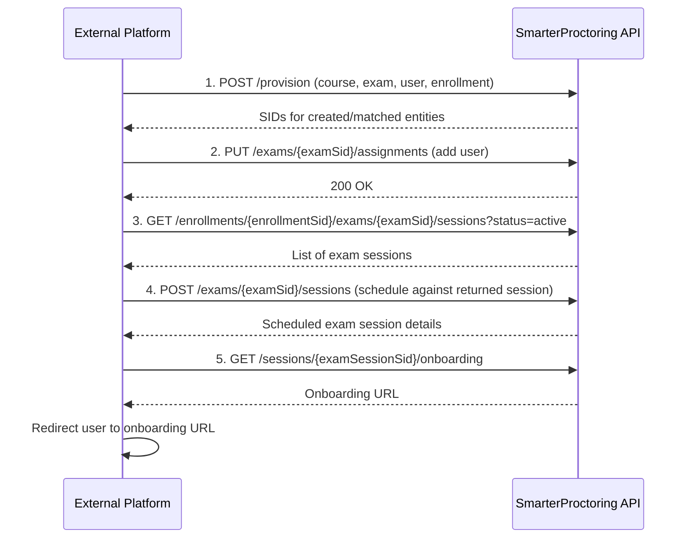

## Overview

This guide walks through the end-to-end process of integrating a 3rd party exam platform with SmarterProctoring. If you operate an external testing or assessment system and wish to leverage SmarterProctoring for proctoring services, this integration pattern covers everything from initial provisioning through to launching a proctored exam session.

The integration follows four key steps:

1. **Provision** the course, exam, user, and enrollment via a single API call
2. **Assign** the user to the exam (required when using limited scope)
3. **Schedule** an exam session for the user
4. **Redirect** the user to the onboarding experience



---

## Prerequisites

Before starting, make sure you have:

- A valid **API token** for authentication. Contact your SmarterProctoring account manager to obtain one.
- Your **Install SID** (`installSid`), which identifies your SmarterProctoring installation. This follows the pattern `AI` + 32 hex characters (e.g., `AIa1b2c3d4e5f6a7b8c9d0e1f2a3b4c5d6`).
- If you plan to use the `signon` object in provisioning, your **Integration SID** (`integrationSid`), which follows the pattern `II` + 32 hex characters.

All API requests must be made over **SSL** and include the API token in the `token` header:

```bash
curl -X POST https://api.smarterproctoring.com... \
  -H "Content-Type: application/json" \
  -H "token: YOUR_API_TOKEN" \
  -d '{ ... }'
```

For a full overview of authentication, see the [Authentication](/proctoring/api/authentication) page.

---

## Step 1: Provision Course, Exam, User, and Enrollment

The [Provision endpoint](/api-reference/provision/bulk-provision-data) is the core of the integration. It allows you to create or reference a course, exam, user, and enrollment in a single API call. This is the call that links all entities together between your external platform and SmarterProctoring.

```
POST /v2/installs/{installSid}/provision
```

### Understanding Resource Identifiers

Each entity in the provision payload requires an `ids` object. You can reference entities using one of the following identifier types:

| Identifier | Description | Use Case |
|---|---|---|
| `sid` | SmarterProctoring system identifier | Reference an entity that already exists in SmarterProctoring |
| `api` | Custom identifier you define | Your own stable ID for tracking across systems |
| `external` | Identifier from your platform | Map your platform's native IDs into SmarterProctoring |
| `lms` | LMS identifier | Used in LMS-based integrations |

<Note>
You only need to provide **one** identifier type per entity. If the entity already exists and you pass its identifier, SmarterProctoring will match against it rather than create a duplicate.
</Note>

For more details, see the [Resource Identifiers](/proctoring/api/resource-identifiers) reference.

### Provision Request Body

Below is a full example of a provision request for a 3rd party integration:

```json
{
  "course": {
    "ids": {
      "external": "client-account-123"
    },
    "title": "Client Account - Acme Corp",
    "code": "ACME-001"
  },
  "exam": {
    "ids": {
      "external": "certification-exam-456"
    },
    "title": "Professional Certification Exam",
    "type": "online",
    "limitedScope": true,
    "configuration": {
      "url": "https://your-exam-platform.com/exam/456",
      "access": {
        "open": "2025-01-01T00:00:00Z",
        "close": "2025-12-31T23:59:59Z"
      },
      "duration": 120,
      "password": "exam-secure-password",
      "attempts": 1,
      "proctorTypes": {
        "TS4b894875d26194988853e490dfb9bc41": {}
      },
      "notes": {
        "student": "Please have your government-issued ID ready.",
        "proctor": "Verify student identity before exam begins."
      }
    }
  },
  "user": {
    "ids": {
      "external": "user-789"
    },
    "firstName": "Jane",
    "lastName": "Smith",
    "email": "jane.smith@example.com",
    "timeZone": "America/New_York"
  },
  "enrollment": {
    "role": "learner"
  }
}
```

### Key Fields Explained

#### Course

The `course` object is **required** in every provision call. For 3rd party integrations where your source system does not have a concept of a "course," you can use this field as an organizational grouping. For example, in a multi-tenant setup, you could place each client account into its own course to segment data cleanly.

| Field | Type | Required | Description |
|---|---|---|---|
| `ids` | object | Yes | At least one identifier (`sid`, `api`, `external`, or `lms`) |
| `title` | string | Conditional | Required if creating a new course (i.e., `sid` is not provided) |
| `code` | string | Conditional | Required if creating a new course |

#### Exam

| Field | Type | Required | Description |
|---|---|---|---|
| `ids` | object | Yes | At least one identifier (`sid` or `external`) |
| `title` | string | Conditional | Required if creating a new exam |
| `type` | string | No | `"online"` (default) or `"written"` |
| `limitedScope` | boolean | No | Defaults to `false`. **Set to `true` for 3rd party integrations** |
| `configuration` | object | Conditional | Required if creating a new exam |

<Warning>
**Important Note:** Most all 3rd party integrations should set `limitedScope` to `true`. When `limitedScope` is `false` (the default), every enrollment automatically receives an exam session. This creates unnecessary sessions and is generally not the desired behavior for external platform integrations where you want explicit control over session creation.
</Warning>

#### Exam Configuration

The `configuration` object within `exam` defines how the exam is set up for proctoring:

| Field | Type | Required | Description |
|---|---|---|---|
| `url` | string | Yes | The URL of the exam on your platform |
| `access.open` | string (ISO 8601) | Yes | Date/time the exam becomes available |
| `access.close` | string (ISO 8601) | Yes | Date/time the exam closes |
| `scheduling.open` | string (ISO 8601) | No | Earliest date/time a student can schedule |
| `scheduling.close` | string (ISO 8601) | No | Latest date/time a student can schedule |
| `duration` | integer | Yes | Exam duration in minutes |
| `password` | string | Yes | Password for exam access |
| `attempts` | integer | No | Number of allowed attempts (default: `1`) |
| `proctorTypes` | object | Yes | Object with proctor type SIDs as keys. See [Proctor Types](/proctoring/api/resource-identifiers#proctor-types) |
| `notes.student` | string | No | Instructions visible to the student |
| `notes.proctor` | string | No | Instructions visible to the proctor |
| `permittedItems` | object | No | Allowed items during the exam (e.g., `calculator`, `notes`) |

#### User

| Field | Type | Required | Description |
|---|---|---|---|
| `ids` | object | Yes | At least one identifier (`sid`, `api`, `external`, or `lms`) |
| `firstName` | string | Conditional | Required if creating a new user |
| `lastName` | string | Conditional | Required if creating a new user |
| `email` | string | Conditional | Required if creating a new user. Must be a valid email address |
| `timeZone` | string | No | IANA time zone (e.g., `"America/New_York"`). Defaults to account-level setting |
| `currencyCode` | string | No | Currency code for the user. Defaults to account-level setting |

#### Enrollment

The `enrollment` object is optional. If omitted and a new user is being created, they will be enrolled as a `learner` by default.

| Field | Type | Required | Description |
|---|---|---|---|
| `role` | string | No | `"learner"` (default) or `"instructor"` |

#### Signon (Optional)

If you want the provision response to return a redirect URL for single sign-on, include the `signon` object:

```json
{
  "signon": {
    "integrationSid": "IIf5a8dc0813f749128504e251fad9e4a3"
  }
}
```

This is useful when you want to immediately redirect the user after provisioning.

---

## Step 2: Update Exam Assignments

When `limitedScope` is set to `true` during provisioning, exam sessions are not automatically created for each enrollment. Instead, you must explicitly add users to the exam via the [Update Exam Assignments](/api-reference/exam/update-exam-assignments) endpoint.

```
PUT /v1/installs/{installSid}/courses/{courseSid}/exams/{examSid}/assignments
```

This call updates the exam's assignment list and adds the newly provisioned user so they are eligible for an exam session.

### Example Request

```json
{
  "add": [
    {
      "enrollmentSid": "EN5f4e3d2c1b0a9z8y7x6w5v4u3t2s1r"
    }
  ]
}
```

<Info>
Use the SIDs returned from the provision call in Step 1 to populate the `courseSid`, `examSid`, and `enrollmentSid` values here.
</Info>

---

## Step 3: Schedule an Exam Session

Once the user has been assigned to the exam, you can schedule their exam session. This is a two-part process:

1. **List** the enrollment's exam sessions to find the correct active session
2. **Schedule** that session with a date and time

### 3a. List Enrollment Exam Sessions

Use the [List Enrollment Exam Sessions](/api-reference/exam-session/list-enrollment-exam-sessions) endpoint to retrieve sessions for the given enrollment and exam combination. Filter by `status=active` to get only the sessions that are eligible for scheduling.

```
GET /v1/installs/{installSid}/enrollments/{enrollmentSid}/exams/{examSid}/sessions?includeActive=true
```

The response will include a list of exam sessions. Identify the session you want to schedule against using its `examSessionSid` (prefixed with `ES`).

### 3b. Schedule the Exam Session

Once you have the `examSessionSid`, call the [Schedule Exam Session](/api-reference/exam-session/schedule-exam-session) endpoint to assign a date and time.

```
POST /v1/installs/{installSid}/exams/{examSid}/sessions/{sessionSid}
```

### Example Request

```json
{
  "type": "automated",
  "proctorLocationSid": "PTa17h8i9j0k1l2m3n4o5b2c3d4e5f6g",
  "appointmentDateTime": "2025-06-15T14:00:00Z",
  "amount": 0,
  "currencyCode": "USD",
  "externalAppointmentId" : "your-system-id"
}
```

<Tip>
  Review the [Resource Identifiers](/proctoring/api/resource-identifiers) page for more information on proctor location types and proctor location sids.
</Tip>

<Tip>
If your integration needs to auto-schedule immediately after provisioning, you can chain Steps 1 through 3 in a single workflow without any user interaction. Just make sure each step completes successfully before moving on.
</Tip>

---

## Step 4: Redirect to Onboarding

The final step is to send the user to the SmarterProctoring onboarding experience. Onboarding walks the student through pre-exam steps such as system checks, identity verification, and environment scans.

Use the [Get Onboarding URL](/api-reference/onboarding/get-the-onboarding-url-for-an-exam-session) endpoint:

```
GET /v1/installs/{installSid}/exams/{examSid}/sessions/{sessionSid}/onboard
```

The response includes a URL that you can redirect the user to in their browser. This can happen in two ways:

- **Immediate redirect**: Call this endpoint right after scheduling and redirect the user to the onboarding URL in the same workflow.
- **Deferred redirect**: Store the `examSessionSid` and call this endpoint later when the user is ready to begin their exam. The onboarding URL is generated on demand, so it is safe to call this at any point after the session has been scheduled.

### Example Response

```json
{
  "url": "https://onboarding.smarterproctoring.com..."
}
```

Redirect the user to the returned `url` to begin the onboarding process.

<Info>
  **IMPORTANT NOTE:** DO NOT save this url as it is a single use URL and will expire.
</Info>

---

## Error Handling

All API responses follow standard HTTP status codes. Common errors you may encounter:

| Error Code | HTTP Status | Description |
|---|---|---|
| `AUTHENTICATIONFAILED` | 403 | Invalid or expired JWT token |
| `INVALIDINPUT` | 400 | Request body validation failed. Check required fields |
| `RESOURCENOTFOUND` | 404 | A referenced SID does not exist |
| `INVALIDPROTOCOL` | 400 | Request was not made over SSL |

<Warning>
Always validate that each step in the integration flow succeeds before proceeding to the next. For example, do not attempt to update assignments if the provision call returned an error.
</Warning>

---

## Best Practices

- **Store SIDs**: Always persist the SIDs returned from the provision call. You will need them for assignments, scheduling, and onboarding.
- **Use external IDs**: Map your platform's native entity IDs into the `external` identifier field. This makes it easy to look up SmarterProctoring entities from your system.
- **Set `limitedScope` to `true`**: This gives you explicit control over session creation and avoids unnecessary exam sessions.
- **Use courses for segmentation**: Even if your platform does not have a course concept, use the course object to group exams logically (e.g., by client account, department, or certification program).
- **Handle idempotency**: The provision endpoint will match existing entities by identifier rather than creating duplicates. You can safely re-call provision with the same IDs if you need to update or re-link entities.
- **Validate time zones**: When creating users, pass an IANA time zone string (e.g., `"America/Chicago"`) so that scheduling displays correctly for the student.