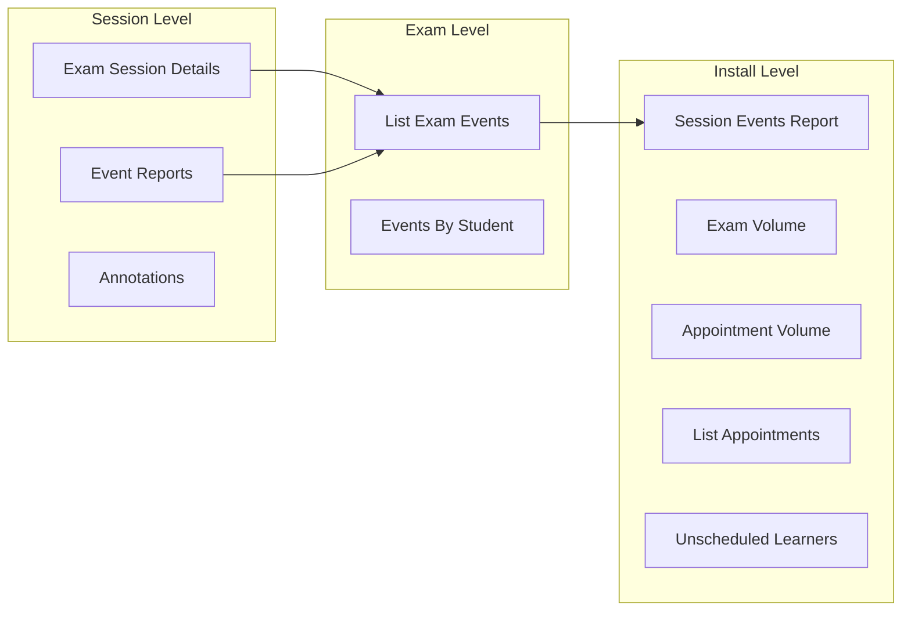
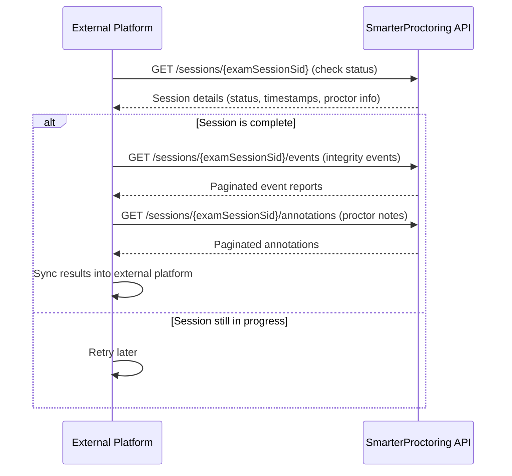
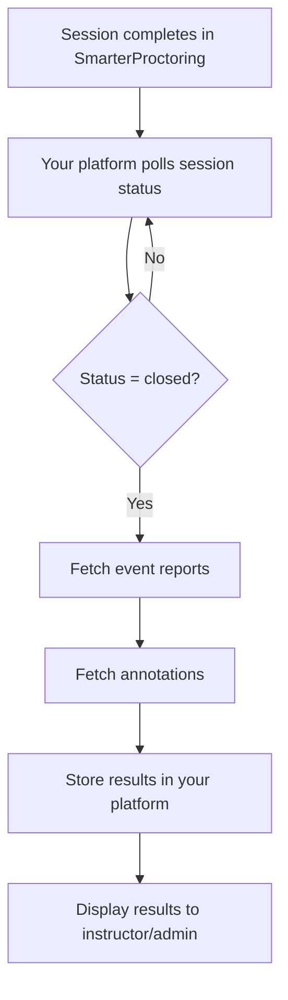
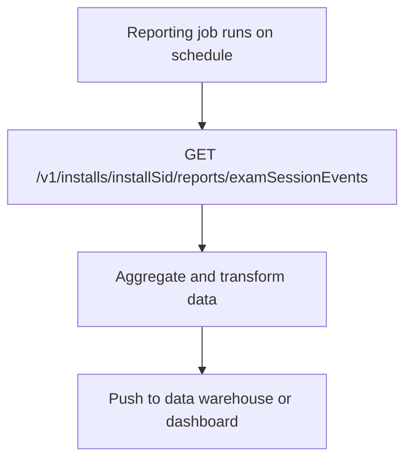

## Overview

Once your organization has adopted SmarterProctoring, you will likely need to pull proctoring results and session data back into your own systems. This page covers the most common reporting integration patterns, the endpoints involved, and how to structure your data retrieval workflows.

SmarterProctoring exposes reporting data at multiple levels of granularity, from high-level volume summaries down to individual session event details. Depending on your use case, you may need one or several of these.



---

## Common Use Cases

The table below maps common integration needs to the appropriate API endpoints. Use this as a quick reference to find the right starting point for your use case.

| Use Case | Primary Endpoint(s) | Level |
|---|---|---|
| Check if a specific session is complete | [Exam Session Details](/api-reference/exam-session/exam-session-details) | Session |
| Get integrity events for a session | [List Event Reports](/api-reference/exam-session-event/list-event-reports) | Session |
| Get proctor annotations/notes for a session | [List Annotations](/api-reference/exam-session-annotation/list-annotations) | Session |
| Pull all session events for your install | [Session Events Report](/api-reference/reports/session-events) | Install |
| List all scheduled appointments | [List Appointments](/api-reference/reports/list-appointments) | Install |
| Find students who have not scheduled | [Unscheduled Learners](/api-reference/reports/unscheduled-learners) | Install |
| Exam volume and usage stats | [Exam Volume](/api-reference/reports/exam-volume) | Install |
| Peak scheduling analysis | [Appointment Volume](/api-reference/reports/appointment-volume) | Install |
| Proctoring modality breakdown | [Modality Distribution](/api-reference/reports/modality-distribution) | Install |
| Service type distribution | [Service Distribution](/api-reference/reports/service-distribution) | Install |

---

## Session-Level Reporting

Session-level reporting gives you the most granular view of what happened during a specific proctored exam. This is the pattern you will use most often when syncing results back to your external platform.

### Retrieving Session Status

To check the current state of a specific exam session, use the [Exam Session Details](/api-reference/exam-session/exam-session-details) endpoint:

```
GET /v1/installs/{installSid}/exams/{examSid}/sessions/{sessionSid}
```

This returns the full session object, including scheduling details, proctoring configuration, and the current session status. Use this to determine whether a session has been completed, is still in progress, or was cancelled.

<Tip>
  If your integration needs to know when a session finishes, you can poll this endpoint periodically.
</Tip>

### Retrieving Integrity Event Reports

Event reports capture notable occurrences during a proctoring session, such as a student losing browser focus, a microphone being detected, or other suspicious activity flagged by the system or proctor.

To get all event reports for a specific session:

```
GET /v1/installs/{installSid}/exams/{examSid}/sessions/{sessionSid}/events
```

See the [List Event Reports](/api-reference/exam-session-event/list-event-reports) reference for available query parameters including filtering and sorting options.

To retrieve the full details of a single event report:

```
GET /v1/installs/{installSid}/exams/{examSid}/sessions/{sessionSid}/events/{eventReportSid}
```

See the [Get Event Report](/api-reference/exam-session-event/get-event-report) reference for the complete response schema.

### Retrieving Annotations

Annotations are notes added by proctors during or after a session review. These provide human context alongside the automated event reports.

```
GET /v1/installs/{installSid}/exams/{examSid}/sessions/{sessionSid}/annotations
```

See the [List Annotations](/api-reference/exam-session-annotation/list-annotations) reference. This endpoint supports filtering and sorting via query parameters, and returns a paginated list of annotation objects.

To get the full details of a specific annotation:

```
GET /v1/installs/{installSid}/exams/{examSid}/sessions/{sessionSid}/annotations/{annotationSid}
```

See [Get Annotation Details](/api-reference/exam-session-annotation/get-annotation-details) for the complete response schema.

### Typical Session-Level Sync Flow

The following sequence shows how a 3rd party platform would pull complete session results after a proctored exam:



---

## Install-Level Reporting

Install-level reports provide aggregate data across your entire SmarterProctoring installation. These are useful for operational dashboards, administrative reporting, and capacity planning.

### Session Events Report

Pull all session event reports across your entire install:

```
GET /v1/installs/{installSid}/reports/examSessionEvents
```

See the [Session Events](/api-reference/reports/session-events) report reference.

### List Appointments

Retrieve all scheduled appointments based on filter parameters:

```
GET /v1/installs/{installSid}/reports/appointments
```

See the [List Appointments](/api-reference/reports/list-appointments) reference. This is useful for building scheduling dashboards or exporting appointment data into external calendar or scheduling systems.

### Unscheduled Learners

Identify students who have been provisioned but have not yet scheduled their exam sessions:

```
GET /v1/installs/{installSid}/reports/unscheduledLearners
```

See the [Unscheduled Learners](/api-reference/reports/unscheduled-learners) reference. This returns a paginated list that your platform can use to send reminders or flag overdue scheduling.

### Volume and Distribution Reports

These reports provide aggregate statistics for operational analysis:

| Report | Description |
|---|---|
| [Exam Volume](/api-reference/reports/exam-volume) | Overall exam volume for your install |
| [Appointment Volume](/api-reference/reports/appointment-volume) | Peak exam appointment analysis |
| [Exams By Week](/api-reference/reports/exams-by-week) | Exams grouped by week for trend analysis |
| [Exam Type Stats](/api-reference/reports/exam-type-stats) | Aggregated stats for exam types (next 10 days) |
| [Modality Distribution](/api-reference/reports/modality-distribution) | Breakdown by proctoring modality |
| [Service Distribution](/api-reference/reports/service-distribution) | Breakdown by service type |
| [Proctor Volume](/api-reference/reports/proctor-volume) | Volume per proctor account |

---

## Integration Patterns

### Pattern 1: Post-Session Sync

The most common reporting integration pattern. After a proctored session completes, your platform pulls the results and stores them locally.



**When to use**: You need proctoring results available inside your own platform's UI and want a simple, reliable sync mechanism.

**Endpoints used**:
- [Exam Session Details](/api-reference/exam-session/exam-session-details) for status polling
- [List Event Reports](/api-reference/exam-session-event/list-event-reports) for integrity data
- [List Annotations](/api-reference/exam-session-annotation/list-annotations) for proctor notes

### Pattern 2: Bulk Exam Reporting

Pull all events across an exam to generate summary reports without iterating through individual sessions.



**When to use**: You are building an admin dashboard or data pipeline that needs to pull session event data across your entire install.

**Endpoints used**:
- [Session Events Report](/api-reference/reports/session-events) for cross-install event data

### Pattern 3: Operational Dashboard

Use install-level reports to monitor scheduling health, volume trends, and proctor utilization across your entire integration.

**When to use**: Operations or support teams need visibility into overall proctoring activity, scheduling bottlenecks, or capacity planning.

**Endpoints used**:
- [Unscheduled Learners](/api-reference/reports/unscheduled-learners) for scheduling follow-ups
- [Exam Volume](/api-reference/reports/exam-volume) and [Appointment Volume](/api-reference/reports/appointment-volume) for trend analysis
- [List Appointments](/api-reference/reports/list-appointments) for a full appointment view
- [Modality Distribution](/api-reference/reports/modality-distribution) and [Service Distribution](/api-reference/reports/service-distribution) for breakdown analysis

---

## Pagination

Most list and report endpoints return paginated results. Use the `offset` and `limit` query parameters to page through results:

```
GET /v1/installs/{installSid}/exams/{examSid}/sessions/{sessionSid}/events?offset=0&limit=25
```

When building a sync job, always iterate through all pages until no more results are returned. A typical pagination loop looks like this:

```javascript
let offset = 0;
const limit = 25;
let allResults = [];

while (true) {
  const response = await fetch(
    `${baseUrl}/events?offset=${offset}&limit=${limit}`,
    { headers: { "token": jwtToken } }
  );
  const data = await response.json();

  if (!data.results || data.results.length === 0) {
    break;
  }

  allResults = allResults.concat(data.results);
  offset += limit;
}
```

---

## Best Practices

- **Poll session status before pulling details.** Always confirm a session is in a terminal state (closed or cancelled) before syncing event reports and annotations. Pulling data from an in-progress session will give you incomplete results.
- **Use exam-level endpoints for batch reporting.** If you need data across many sessions, prefer the exam-level event endpoints over making individual session-level calls. This reduces the number of API requests and simplifies your code.
- **Paginate all list responses.** Never assume a single API call will return all results. Always implement pagination logic in your reporting jobs.
- **Store SIDs for lookups.** Keep a mapping of your platform's IDs to SmarterProctoring SIDs (install, course, exam, enrollment, session). This makes it straightforward to query the right endpoints without additional lookup calls.
- **Schedule reporting jobs during off-peak hours.** If you run bulk reporting syncs, consider scheduling them outside of peak exam times to minimize API load.
- **Cache install-level reports.** Volume and distribution reports change infrequently. Cache their results on your side and refresh on a schedule (e.g., every 15 to 30 minutes) rather than on every page load.