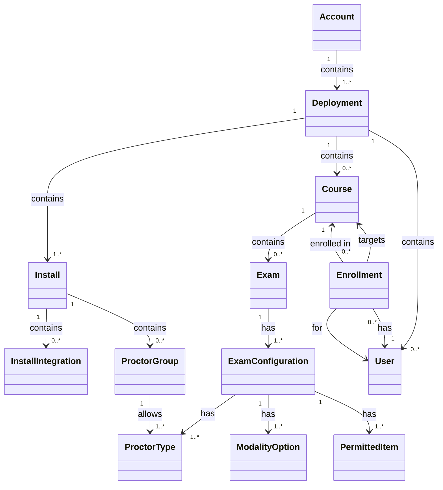

## Data Model

The following diagram shows the data model for the Proctoring application.

```mermaid
  classDiagram
    class Account
    class Deployment
    class Install
    class Course
    class User
    class Enrollment
    class InstallIntegration
    class Exam
    class ExamConfiguration
    class ProctorType
    class ModalityOption
    class PermittedItem
    class ProctorGroup

    Account "1" --> "1..*" Deployment : contains
    Deployment "1" --> "1..*" Install : contains
    Deployment "1" --> "0..*" Course : contains
    Deployment "1" --> "0..*" User : contains

    Install "1" --> "0..*" InstallIntegration : contains
    Install "1" --> "0..*" ProctorGroup : contains

    Course "1" --> "0..*" Exam : contains

    Exam "1" --> "1..*" ExamConfiguration : has

    ExamConfiguration "1" --> "1..*" ProctorType : has
    ExamConfiguration "1" --> "1..*" ModalityOption : has
    ExamConfiguration "1" --> "1..*" PermittedItem : has

    ProctorGroup "1" --> "1..*" ProctorType : allows

    Course "1" <-- "0..*" Enrollment : enrolled in
    User "1" <-- "0..*" Enrollment : has

    Enrollment --> Course : targets
    Enrollment --> User : for

```