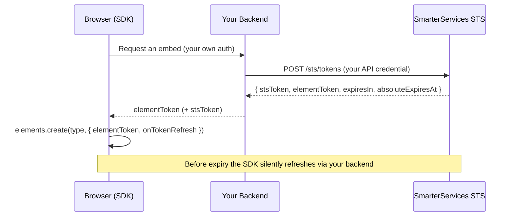
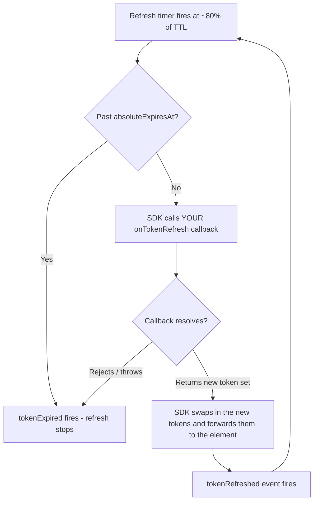

# Authentication & Tokens

SmarterElements embeds are authenticated with **short-lived, narrowly-scoped, revocable STS tokens** issued by your backend through the SmarterServices Security Token Service (STS). Your long-lived API credential **never** reaches the browser — your server exchanges it for a token that is scoped to a single element, a single end user, and a short lifetime, then hands that token to the SDK.

<Note>
  STS is a generic token service; SmarterElements embeds use the `element` token type. Each issued
  token is bounded by the **permission ceiling** of the credential that created it — a token can
  never grant more than its creator already has.
</Note>

<Note>
  For general-purpose short-lived API access, STS also supports an `api` token type with a
  caller-supplied, ceiling-checked IAM policy. See [STS Tokens](/platform/security/sts-tokens) for
  both minting methods and their shared security guardrails.
</Note>

## How it works



1. The browser asks **your** backend for an embed (authenticated however you already authenticate your users).
2. Your backend calls the STS endpoint using its own API credential and gets back a token set.
3. Your backend returns the signed `elementToken` (and optionally the runtime `stsToken`) to the browser.
4. The browser passes them to `elements.create(...)`; the SDK silently refreshes before expiry.

## Issue a token

Call this from your **backend** (never the browser — it requires your API credential):

```http
POST /v1/installs/{installSid}/sts/tokens
Authorization: Bearer <your-api-credential>
Content-Type: application/json
```

```json
{
  "tokenType": "element",
  "elementType": "proctoring-session",
  "resource": "ES123456",
  "targetUserSid": "US0123456789012345678901234567890",
  "expiresIn": 900
}
```

### Request body

| Field           | Type     | Required | Description                                                                                                                                     |
| --------------- | -------- | -------- | ----------------------------------------------------------------------------------------------------------------------------------------------- |
| `tokenType`     | `string` | yes      | The STS token type. Use `"element"` for SmarterElements embeds.                                                                                 |
| `elementType`   | `string` | yes      | The element the token is scoped to (e.g. `exam-session`, `proctoring-session`, `assessment-viewer`).                                            |
| `targetUserSid` | `string` | yes      | The end user the embed represents.                                                                                                              |
| `resource`      | `string` | no       | The specific resource id the embed targets (e.g. a session SID). Defaults to a wildcard within the deployment.                                  |
| `expiresIn`     | `number` | no       | Requested lifetime in seconds. Defaults to **900 (15m)**, capped at **3600 (1h)** and further clamped by the deployment's `maxTokenTtlSeconds`. |

The caller must hold the `sp:CreateStsToken` action; the resulting token's policy is validated as a **subset** of the caller's effective policy before anything is minted.

### Response `201`

```json
{
  "sid": "TA0123456789012345678901234567890",
  "stsToken": "tok_8f2c…",
  "elementToken": "eyJhbGciOiJSUzI1Ni…",
  "elementType": "proctoring-session",
  "tokenType": "element",
  "expiresAt": "2026-06-30T03:15:00.000Z",
  "expiresIn": 900,
  "absoluteExpiresAt": "2026-06-30T10:36:00.000Z"
}
```

| Field               | Description                                                                                                                                                                                  |
| ------------------- | -------------------------------------------------------------------------------------------------------------------------------------------------------------------------------------------- |
| `stsToken`          | The **opaque runtime credential** the embed uses for API calls. Returned on issuance and refresh, and can be revoked instantly.                                                              |
| `elementToken`      | An **RS256/JWKS-signed** assertion that binds the identity + resource + token. Passed to the SDK as `elementToken` so the element's identity can't be tampered with. |
| `expiresIn`         | Seconds until the runtime credential expires.                                                                                                                                                |
| `absoluteExpiresAt` | Hard cap across refreshes (8h from the root token). Silent refresh stops here.                                                                                                               |

## Pass the token to the SDK

Give the SDK the signed `elementToken` as `elementToken`, the opaque runtime credential as `stsToken`, and an `onTokenRefresh` callback that fetches a fresh token set from your backend. The SDK schedules a silent refresh before expiry (default at 80% of the TTL) and stops at `absoluteExpiresAt`.

```javascript
import { SmarterElements } from '@smarterservices/smarter-elements';

const elements = new SmarterElements({ baseUrl: '/elements' });

// Your backend returns { elementToken, stsToken, expiresIn, absoluteExpiresAt }
const initial = await fetch('/api/embeds/proctoring-token').then(r => r.json());

const element = elements.create('proctoring/sessionviewer', {
  config: { sessionSid: 'ES123456' },

  // RS256-signed element identity assertion
  elementToken: initial.elementToken,
  // Opaque runtime credential (optional; for embeds that call APIs)
  stsToken: initial.stsToken,
  tokenExpiresIn: initial.expiresIn,
  // `absoluteExpiresAt` is an ISO string from the API; the SDK wants epoch ms
  tokenAbsoluteExpiresAt: new Date(initial.absoluteExpiresAt).getTime(),

  // Called shortly before expiry to rotate silently
  onTokenRefresh: async () => {
    const next = await fetch('/api/embeds/proctoring-token/refresh', {
      method: 'POST',
    }).then(r => r.json());
    return {
      elementToken: next.elementToken,
      stsToken: next.stsToken,
      expiresIn: next.expiresIn,
      absoluteExpiresAt: new Date(next.absoluteExpiresAt).getTime(),
    };
  },
});

// Lifecycle events fire on the instance
element.on('tokenRefreshed', () => console.log('Embed token rotated'));
element.on('tokenExpired', () => console.log('Embed session ended'));

element.mount('#proctoring');
```

<Warning>
  Never embed a long-lived API key or a broad `spToken` in the browser. Only the short-lived
  `elementToken` (and optionally the scoped runtime `stsToken`) should ever reach client-side code.
</Warning>

## Silent refresh

Long-lived embeds outlive a single 15-minute token, so the SDK rotates them automatically:

- The SDK schedules a refresh at ~80% of the current token's TTL (floored at 5s to avoid hot loops).
- Your `onTokenRefresh` callback calls the refresh endpoint and returns a new token set.
- The new `stsToken` (runtime credential) is forwarded to the element and a `tokenRefreshed` event fires (refresh rotates the credential; the signed `elementToken` is issuance-only).
- Once `absoluteExpiresAt` (8h from the first token) is reached, refresh stops and `tokenExpired` fires.

The refresh cycle runs in this order:



<Note>
  The SDK owns the *scheduling and lifecycle* — you don't track expiry or wire up timers. But you
  **must** supply the `onTokenRefresh` callback: the STS refresh endpoint requires your API
  credential, which must never live in the browser, so the callback bounces the refresh through your
  backend. If you omit it, the token simply expires and the embed ends when the TTL runs out.
</Note>

### Wire up the refresh callback

Pass `onTokenRefresh` to `elements.create(...)`. The SDK calls it shortly before expiry; it must fetch a fresh token set from your backend (which calls the STS refresh endpoint with your API credential) and return it:

```javascript
const element = elements.create('proctoring/sessionviewer', {
  config: { sessionSid: 'ES123456' },

  // Initial token set from your backend
  elementToken: initial.elementToken,
  stsToken: initial.stsToken,
  tokenExpiresIn: initial.expiresIn,
  tokenAbsoluteExpiresAt: new Date(initial.absoluteExpiresAt).getTime(),

  // Called by the SDK shortly before expiry — return the NEXT token set.
  // Your backend performs the privileged STS refresh call.
  onTokenRefresh: async () => {
    const next = await fetch('/api/embeds/proctoring-token/refresh', {
      method: 'POST',
    }).then(r => r.json());

    return {
      elementToken: next.elementToken, // optional — signed assertion on issuance
      stsToken: next.stsToken, // required — the new runtime credential
      expiresIn: next.expiresIn, // required — TTL of the new token
      absoluteExpiresAt: new Date(next.absoluteExpiresAt).getTime(),
    };
  },
});

element.on('tokenRefreshed', () => console.log('Embed token rotated'));
element.on('tokenExpired', () => console.log('Embed session ended'));
```

#### `onTokenRefresh` return shape

The callback must resolve with an `StsTokenSet` containing:

| Field               | Type                | Required | Description                                                                                                                       |
| ------------------- | ------------------- | -------- | --------------------------------------------------------------------------------------------------------------------------------- |
| `stsToken`          | `string`            | Yes      | Opaque runtime credential from your backend's STS refresh response.                                                               |
| `expiresIn`          | `number` (seconds)  | Yes      | TTL of the new token; the SDK uses it to schedule the next refresh.                                                               |
| `elementToken`      | `string`            | No       | Signed identity assertion; only present on element issuance, not refresh, so it is typically omitted here.                      |
| `absoluteExpiresAt` | `number` (epoch ms) | No       | Hard cap across refreshes; when reached, the SDK stops and fires `tokenExpired`. The API returns an ISO string; convert it with `new Date(next.absoluteExpiresAt).getTime()`. |

Resolving with a valid set applies the new tokens and fires `tokenRefreshed`. Throwing or returning a rejected promise fires `tokenExpired` and ends the session.

### Refresh endpoint

```http
POST /v1/installs/{installSid}/sts/tokens/{tokenSid}/refresh
Authorization: Bearer <your-api-credential>
```

```json
{ "expiresIn": 900 }
```

Returns a new token set with a `previousSid` field. The old credential is revoked once the replacement is minted. Refresh requires the `sp:RefreshStsToken` action and reuses the original token's scoped policy — a refresh can never widen permissions or extend past the absolute session lifetime.

## Security model

| Boundary                   | Enforcement                                                                                                           |
| -------------------------- | --------------------------------------------------------------------------------------------------------------------- |
| **No browser credentials** | Only the short-lived `elementToken` / scoped `stsToken` reach the browser. Your API credential stays on your backend. |
| **Permission ceiling**     | The token's policy must be a subset of the creating credential's policy (`validatePolicySubset`).                     |
| **Short TTL**              | 15m default, 1h max, clamped by the deployment's `maxTokenTtlSeconds`.                                                |
| **Absolute lifetime**      | Silent refresh is capped at 8h from the root token.                                                                   |
| **Instant revocation**     | The runtime `stsToken` is opaque and server-validated, so revocation takes effect immediately.                        |
| **Tamper-proof identity**  | `elementToken` is RS256-signed via the OIDC JWKS keys and verified server-side before the embed is trusted.           |

---

## For end users

When you open a SmarterElements embed (for example, a proctoring session viewer inside your LMS), the embed signs in automatically using a temporary, single-purpose access pass created just for you by your institution's system. This pass only works for that one embed, expires after a short time, and renews quietly in the background while you keep working — so you never have to log in again inside the embed, and your full account credentials are never shared with it. If you leave the embed open for a long time, it will eventually end the session for security and you can simply reopen it.
